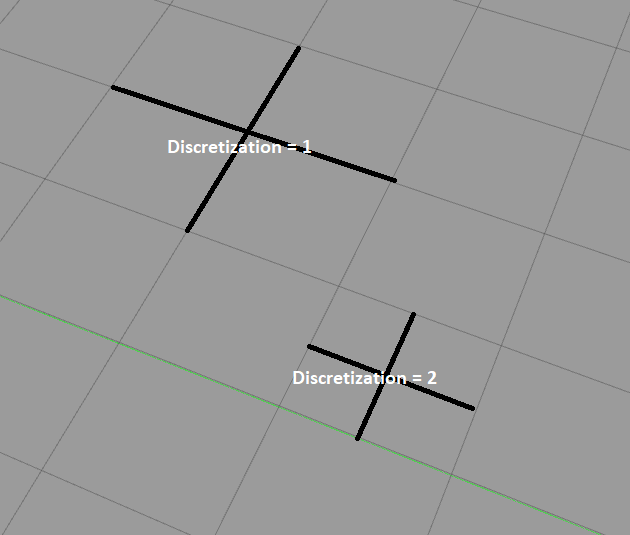

# Traffic Alert and Collision Avoidance System - Gazebo Simulation

Robot and world models heavily based on: https://bitbucket.org/theconstructcore/box_bot/src/foxy/

## Requirements

ROS2 Foxy

sudo pip3 install transforms3d
sudo apt-get install ros-foxy-tf-transformations

## To launch gazebo world and N robots

In a new terminal:
```sh
source install/setup.bash

ros2 launch box_bot_gazebo multi_box_bot_launch.py
```

## To launch path planner and control robots:

In a new terminal:

```sh
source install/setup.bash

ros2 launch planning planner_launch.py
```

## Basic Architecture

Subscribe to all robot position via: /{robot_name}/odom topic
Publish to all robot velocity command via: /{robot_name}/cmd_vel topic
In which robot_name is robot0, robot1, robot2, ...

### Discretization of map and adjustments

The current implementation of CBS only allows positive integers as inputs and outputs. To workround that, we shift the map so that every point that is inside gazebo default area is a positive integer. Also, we shrink/inflate points according to how we discretize the map. This is done before calling CBS and the other way around when reading CBS solution.



Recommended values for discretization: 1 or 2. Other values should also work.


### Continuously planning

variable REPLAN in /planning/scripts/planner.py
True -> Plan and execute continuosly 
False -> Plan and execute once

### To set custom goals:

Set CUSTOM_GOALS = True in planning/scripts/planner.py

Modify goals in planning/params/custom_goals.yaml

If goals of more than one robot are at the same positions, robots will pick another goal close to the original one.

## Alarm

The solution of CBS is published to the topic /planning_alarm as a string.

## Observations

- Multi Agent Centralized Conflict Search Based Path planning (CBS MAPF) 
- Path planner reads start positions and goals for the robots and outputs a schedule of positions for robots to follow
- Number of robots is hardcoded in /TCAS/box_bot_description/launch/multi_spawn_robot_launch.py
- Robots are differential drive (like turtlebots)
- A feedback linearization controller was implemented (To move diff drive robots from initial position X,Y to final position X,Y)

## Path Planning Demos

Robots have to reach random or custom targets. Conflict Based Search solve for collisions. Robots follow collision free trajectories.

[OBSTACLE FREE - CUSTOM GOALS - 10 ROBOTS](https://youtu.be/oolDAnwFhWY)

[OBSTACLE FREE - RANDOM GOALS - 15 ROBOTS](https://youtu.be/EQ7SeHiKW7A)

[WITH OBSTACLES - RANDOM GOALS - 8 ROBOTS](https://youtu.be/HCOMOpOvJdI)

[WITH OBSTACLES - RANDOM GOALS - 15 ROBOTS](https://youtu.be/qwxTIXPNZy4)

[WITH MORE OBSTACLES - RANDOM GOALS - 8 ROBOTS](https://youtu.be/rtTe340uOhU)

## Limitations

- Robots wait other robots before going to new positions, this sincronization is be needed for correct execution of the plan
- Collisions may occur if size of robots is too big in relation with map discretization and obstacles sizes (Path Planning is not aware of robot dynamics)
- CBS code allows positive integers only. Workaround used: shift all values, run CBS, shift values back.
- Robots may spawn on top of obstacles which makes the approach invalid. If this happens, relaunch ros2 launch box_bot_gazebo multi_box_bot_launch.py so that they spawn in other positions. (TODO: check this collisions)
- Obstacles have to be added manually both in the world file (box_bot_gazebo/worlds/box_bot_empty.world) and in the file read by the planner(planning/scripts/params/custom_obstacles.yaml)

## References

- Launch files, world files and robot files based on based on: https://bitbucket.org/theconstructcore/box_bot/src/foxy/
- CBS planner implementation: https://github.com/atb033/multi_agent_path_planning/tree/master/centralized/cbs
- CBS planner theory: https://www.sciencedirect.com/science/article/pii/S0004370214001386